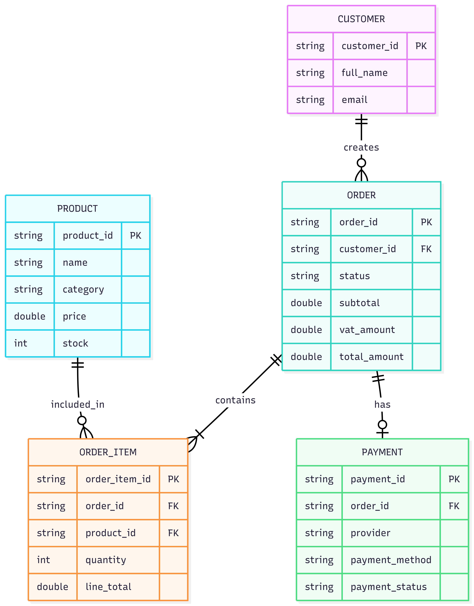
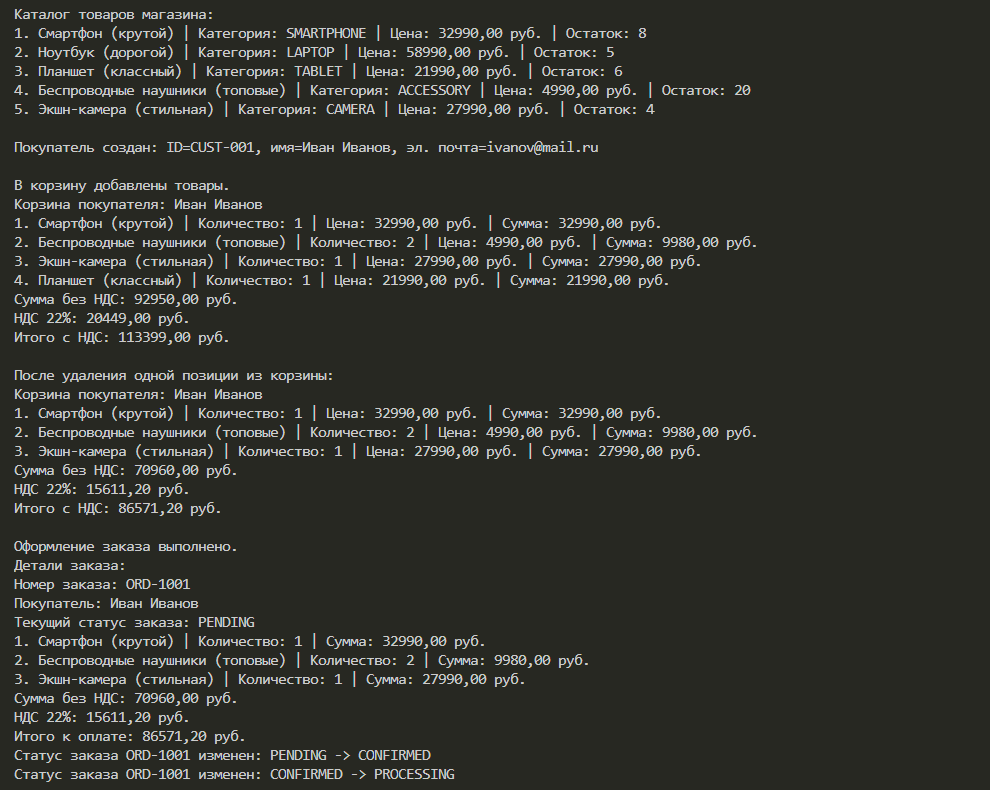
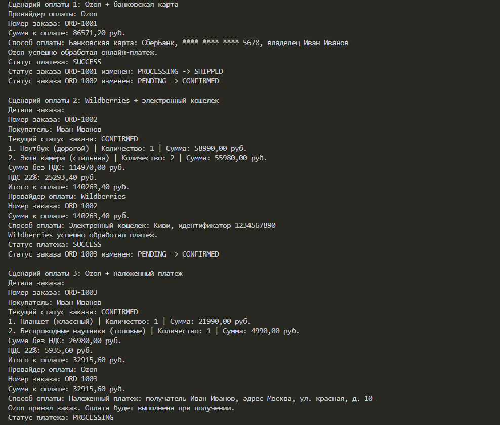
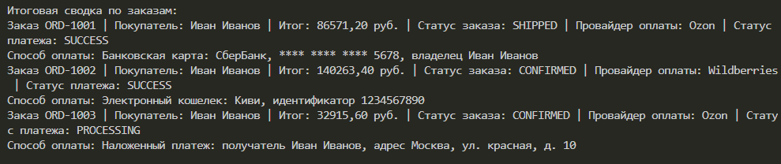

# Консольное приложение интернет-магазина

| | |
|---|---|
| **Дисциплина** | Современные технологии программирования |
| **Тип проекта** | Консольное Java-приложение |

---

## Сведения о команде

```text
Группа: ПИ24-3В
Команда: 123321

Студенты:
1. Ирисов Дильшат Рашидович — порядковый номер в группе: 5
2. Пахомов Тимофей Денисович — порядковый номер в группе: 11
3. Тулбаева Регина Наилевна — порядковый номер в группе: 15
```

---

## Цель работы

Спроектировать и реализовать консольное приложение магазина на современном Java, демонстрирующее объектно-ориентированный подход, применение `class`, `record`, `enum`, `interface`, `sealed interface`, а также паттерна «Стратегия» для провайдеров оплаты.

---

## Реализованные возможности

- вывод каталога товаров с категорией, ценой и остатком
- создание покупателя
- работа с корзиной: добавление и удаление товаров
- расчет суммы без НДС, НДС 22% и итоговой суммы
- оформление заказа на основе корзины
- отображение деталей заказа
- изменение статусов заказа
- три сценария оплаты:
  - `Ozon + банковская карта`
  - `Wildberries + электронный кошелек`
  - `Ozon + наложенный платеж`
- итоговая сводка по заказам

---

## Использованные средства Java

| Средство | Где используется |
|---|---|
| **Classes** | `Customer`, `ShoppingCart`, `Order` |
| **Records** | `Product`, `CartItem`, `OrderItem` |
| **Interface** | `Payment` |
| **Sealed interface** | `PaymentMethod` |
| **Enums** | `OrderStatus`, `ProductCategory`, `PaymentStatus` |
| **Collections** | `HashMap` для каталога, `ArrayList` для корзины и строк заказа |

---

## Структура проекта

Корневой пакет: `com.moderntech.ecommerce`

```text
src/
└── com/
    └── moderntech/
        └── ecommerce/
            ├── main/
            │   └── ECommerceApp.java
            ├── models/
            │   ├── Product.java
            │   ├── Customer.java
            │   ├── ShoppingCart.java
            │   ├── Order.java
            │   ├── CartItem.java
            │   └── OrderItem.java
            ├── payment/
            │   ├── Payment.java
            │   ├── PaymentMethod.java
            │   ├── CreditCardPayment.java
            │   ├── DigitalWalletPayment.java
            │   ├── CashOnDelivery.java
            │   ├── OzonPayment.java
            │   ├── WildberriesPayment.java
            │   └── PaymentStatus.java
            └── enums/
                ├── OrderStatus.java
                └── ProductCategory.java

out/
└── com/
    └── moderntech/
        └── ecommerce/
            └── ... compiled .class files
```

---

## Перечисления

- `OrderStatus`: `PENDING`, `CONFIRMED`, `PROCESSING`, `SHIPPED`, `DELIVERED`, `CANCELLED`
- `ProductCategory`: `SMARTPHONE`, `LAPTOP`, `TABLET`, `ACCESSORY`, `CAMERA`
- `PaymentStatus`: `PENDING`, `SUCCESS`, `FAILED`, `REFUNDED`, `PROCESSING`

---

## Как запустить

### Запуск из терминала

Сборка:

```powershell
javac -d out -sourcepath src src\com\moderntech\ecommerce\main\ECommerceApp.java
```

Запуск:

```powershell
java -cp out com.moderntech.ecommerce.main.ECommerceApp
```

## Сценарии, показанные в программе

1. Создание каталога из 5 товаров.
2. Создание покупателя.
3. Добавление товаров в корзину.
4. Удаление одной позиции из корзины.
5. Оформление заказа.
6. Изменение статуса заказа.
7. Оплата через `Ozon` банковской картой.
8. Оплата через `Wildberries` электронным кошельком.
9. Оплата через `Ozon` наложенным платежом.
10. Вывод итоговой сводки по заказам.

---

## Ключевые решения

- каталог реализован на `HashMap<String, Product>`
- корзина реализована на `ArrayList<CartItem>`
- заказ создается из содержимого корзины
- для способов оплаты используется `sealed interface PaymentMethod`
- для провайдеров оплаты используется интерфейс `Payment`, что демонстрирует паттерн «Стратегия»
- расчет НДС выполняется внутри корзины и переносится в заказ при оформлении

---

## ERD



---

## Каталог + оформление заказа



---

## Сценарии оплаты



---

## Итоговая сводка по заказам

